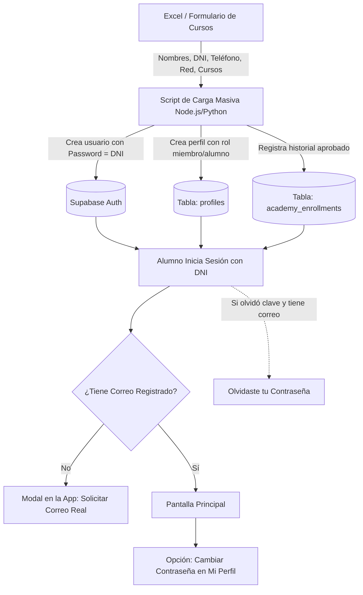

# Proceso de Implementación: Importación Masiva de Alumnos y Gestión de Credenciales (DNI)

Este documento detalla el flujo de arquitectura, base de datos, script de importación desde Excel y la experiencia de usuario dentro de la app **Alianza Chaclacayo**.

---

## 1. Visión General del Flujo



---

## 2. Estructura de Datos Requerida en el Excel

Para que el script procese los datos de forma limpia, el archivo Excel o Google Sheets debe tener las siguientes columnas:

| Columna | Nombre de Campo | Tipo | Ejemplo / Descripción |
| :--- | :--- | :--- | :--- |
| **A** | `nombres` | Texto | Juan Carlos |
| **B** | `apellidos` | Texto | Pérez Ramos |
| **C** | `dni` | Texto | `74829103` (8 dígitos) |
| **D** | `telefono` | Texto | `987654321` |
| **E** | `red` | Texto | `dunamis`, `legado`, `mujeres`, `varones`, etc. |
| **F** | `correo` | Texto (Opcional) | `juan.perez@gmail.com` (Si no tiene, se deja vacío) |
| **G** | `cursos_aprobados` | Texto | Separados por comas: `Bautismo, ABC Cristiano, Madurez Cristiana` |

---

## 3. Estrategia de Autenticación y Cuentas (DNI / Contraseña)

1. **Creación del Usuario:**
   - **Identificador de acceso inicial:** DNI del alumno.
   - **Contraseña inicial:** DNI del alumno (ej: `74829103`).
   - **Correo en Auth:**
     - Si el alumno **colocó correo real en el Excel**, se registra con ese correo.
     - Si el alumno **no tiene correo en el Excel**, se crea la cuenta interna en Supabase Auth y en la app se le pedirá ingresar su correo en su primer inicio de sesión.
2. **Inicio de Sesión en la App:**
   - El alumno digita su **DNI** y su contraseña inicial (**mismo DNI**).
   - La app lo autentica automáticamente contra Supabase.

---

## 4. Experiencia de Usuario en la Aplicación

### A. Solicitud de Correo Electrónico Real (Sin alias ficticios)
- Cuando el alumno ingresa por primera vez y su perfil tiene el campo `email` vacío o no registrado:
  - Aparece un banner o modal amigable:
    > *«¡Bienvenido Juan! Para proteger tu cuenta y poder recuperar tu acceso en caso lo olvides, por favor ingresa tu correo electrónico personal.»*
  - El alumno ingresa su correo real y se actualiza en su perfil y en Supabase Auth (`supabase.auth.updateUser(UserAttributes(email: ...))`).

### B. Cambio de Contraseña desde la App
- Dentro de la pantalla **Mi Perfil** ([perfil_screen.dart](file:///home/zbrun0/Proyectos/alianza_chaclacayo_app/lib/features/perfil/presentation/perfil_screen.dart)), se agrega la sección:
  - Botón: **"Cambiar Contraseña"**.
  - Modal con:
    - Nueva contraseña.
    - Confirmar nueva contraseña.
  - Al presionar *Guardar*, se ejecuta:
    ```dart
    await Supabase.instance.client.auth.updateUser(
      UserAttributes(password: newPasswordController.text),
    );
    ```

### C. Recuperación de Acceso ("¿Olvidaste tu contraseña?")
- En la pantalla de [login_screen.dart](file:///home/zbrun0/Proyectos/alianza_chaclacayo_app/lib/features/auth/presentation/login_screen.dart):
  - Botón: **"¿Olvidaste tu contraseña?"**.
  - El usuario ingresa su DNI o Correo.
  - Si el usuario tiene correo registrado, el sistema le envía un enlace seguro para restablecer su contraseña.
  - Si aún no tenía correo registrado, se le muestra un mensaje indicando que puede solicitar el restablecimiento a la secretaría o soporte técnico de la iglesia.

---

## 5. Script de Importación Masiva (Node.js / Supabase Admin SDK)

Cuando los hermanos terminen de llenar el formulario y tengas el archivo Excel exportado a `.xlsx` o `.csv`, utilizaremos el siguiente script automatizado con la `SUPABASE_SERVICE_ROLE_KEY` para crear usuarios e historiales en segundos:

```javascript
// scripts/import_students.js
const { createClient } = require('@supabase/supabase-js');
const xlsx = require('xlsx');

const SUPABASE_URL = 'https://nnsqxguuefqixscmrrwd.supabase.co';
const SUPABASE_SERVICE_ROLE_KEY = process.env.SUPABASE_SERVICE_ROLE_KEY;

const supabase = createClient(SUPABASE_URL, SUPABASE_SERVICE_ROLE_KEY, {
  auth: { autoRefreshToken: false, persistSession: false }
});

async function importStudents(excelFilePath) {
  const workbook = xlsx.readFile(excelFilePath);
  const sheet = workbook.Sheets[workbook.SheetNames[0]];
  const rows = xlsx.utils.sheet_to_json(sheet);

  console.log(`Iniciando importación de ${rows.length} registros...`);

  for (const row of rows) {
    const dni = String(row.dni || '').trim();
    const firstName = String(row.nombres || '').trim();
    const lastName = String(row.apellidos || '').trim();
    const phone = String(row.telefono || '').trim();
    const network = String(row.red || 'dunamis').toLowerCase().trim();
    const email = row.correo ? String(row.correo).trim() : null;
    const coursesStr = String(row.cursos_aprobados || '');

    if (!dni || dni.length < 8) {
      console.warn(`Saltando registro inválido: ${firstName} ${lastName} (DNI: ${dni})`);
      continue;
    }

    try {
      // 1. Crear usuario en Supabase Auth con password = DNI
      const authPayload = {
        password: dni,
        email_confirm: true,
        user_metadata: {
          first_name: firstName,
          last_name: lastName,
          dni: dni,
          phone: phone,
          assigned_network: network
        }
      };

      // Si tiene correo real, usarlo; de lo contrario se usa identificador por DNI
      if (email) {
        authPayload.email = email;
      } else {
        authPayload.email = `${dni}@temp.alianzachaclacayo.pe`; // Alias de sistema interno para Auth
      }

      const { data: authUser, error: authError } = await supabase.auth.admin.createUser(authPayload);

      let userId = authUser?.user?.id;

      if (authError) {
        // Si el usuario ya existía por DNI, buscar su ID
        const { data: existingProfile } = await supabase
          .from('profiles')
          .select('id')
          .eq('dni', dni)
          .maybeSingle();

        if (existingProfile) {
          userId = existingProfile.id;
        } else {
          console.error(`Error creando auth para DNI ${dni}:`, authError.message);
          continue;
        }
      }

      // 2. Insertar o actualizar Perfil
      await supabase.from('profiles').upsert({
        id: userId,
        first_name: firstName,
        last_name: lastName,
        dni: dni,
        phone: phone,
        assigned_network: network,
        email: email || '',
        role: 'miembro',
        is_approved: true
      });

      // 3. Registrar Historial de Cursos Aprobados
      if (coursesStr.trim().length > 0) {
        const courseNames = coursesStr.split(',').map(c => c.trim()).filter(Boolean);
        for (const cName of courseNames) {
          // Buscar ID del curso por nombre aproximado
          const { data: course } = await supabase
            .from('academy_courses')
            .select('id')
            .ilike('title', `%${cName}%`)
            .maybeSingle();

          if (course) {
            await supabase.from('academy_enrollments').upsert({
              user_id: userId,
              course_id: course.id,
              status: 'aprobado',
              approved_at: new Date().toISOString()
            });
          }
        }
      }

      console.log(`✅ Alumno procesado con éxito: ${firstName} ${lastName} (${dni})`);
    } catch (err) {
      console.error(`❌ Error con ${dni}:`, err.message);
    }
  }

  console.log('🎉 Importación masiva finalizada con éxito.');
}
```

---

## 6. Lista de Pasos para Cuando Tengas el Excel Listo

1. **Recolección de datos:** Finalizar el llenado del formulario por parte de los hermanos.
2. **Descarga del archivo:** Exportar la hoja a Excel (`.xlsx` o `.csv`).
3. **Ejecución del script:** Ejecutaremos el script de importación en el servidor/terminal.
4. **Activación de vistas en la App:**
   - Activar el botón de *Cambiar Contraseña* en el Perfil.
   - Activar el formulario de recuperación *¿Olvidaste tu contraseña?* en el Login.
   - Activar el aviso para que los alumnos que no tenían correo puedan registrar su correo personal al ingresar.
